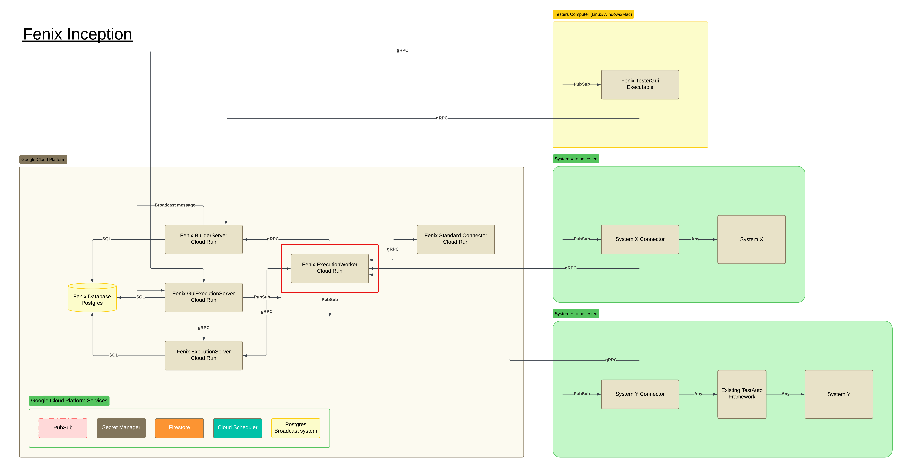

MIT License

Copyright (c) 2024 Jonas Lambert

Permission is hereby granted, free of charge, to any person obtaining a copy of this software and associated documentation files (the "Software"), to deal in the Software without restriction, including without limitation the rights to use, copy, modify, merge, publish, distribute, sublicense, and/or sell copies of the Software, and to permit persons to whom the Software is furnished to do so, subject to the following conditions:

The above copyright notice and this permission notice shall be included in all copies or substantial portions of the Software.

THE SOFTWARE IS PROVIDED "AS IS", WITHOUT WARRANTY OF ANY KIND, EXPRESS OR IMPLIED, INCLUDING BUT NOT LIMITED TO THE WARRANTIES OF MERCHANTABILITY, FITNESS FOR A PARTICULAR PURPOSE AND NONINFRINGEMENT. IN NO EVENT SHALL THE AUTHORS OR COPYRIGHT HOLDERS BE LIABLE FOR ANY CLAIM, DAMAGES OR OTHER LIABILITY, WHETHER IN AN ACTION OF CONTRACT, TORT OR OTHERWISE, ARISING FROM, OUT OF OR IN CONNECTION WITH THE SOFTWARE OR THE USE OR OTHER DEALINGS IN THE SOFTWARE.

***

# Fenix Inception

## ExecutionWorker
ExecutionWorker has the responsibility to feed TestInstructions to be executed to the correct Connectors. For all Connector that is not belonging to Fenix Inception itself then PubSub is used as transportation method. For Connectors belonging to Fenix Inception then gRPC is used.
Another responsibility is to receive published available TestInstructions, TestInstructionContainers, Allowed Users and Template-address.

The following environment variable is needed for ExecutionWorker to be able to run.

| Environment variable                          | Example value                                                           | comment                                     |
|-----------------------------------------------|-------------------------------------------------------------------------|---------------------------------------------|
| AuthClientId                                  | 46368345345345-au53543bleflkfs03423dfs.apps.googleusercontent.com       |                                             |
| AuthClientSecret                              | UYGJIU-KHskjshd7HDK7sdfsdf                                              |                                             |
| ExecutionLocationForFenixGuiBuilderServer     | GCP                                                                     | LOCALHOST_NODOCKER, LOCALHOST_DOCKER or GCP |
| ExecutionLocationForFenixTestExecutionServer  | GCP                                                                     | LOCALHOST_NODOCKER, LOCALHOST_DOCKER or GCP |
| ExecutionLocationForWorker                    | GCP                                                                     | LOCALHOST_NODOCKER, LOCALHOST_DOCKER or GCP |
| ExecutionWorkerPort                           | 6671                                                                    |                                             |
| FenixExecutionServerAddress                   | fenixexecutionserver-must-be-logged-in-ffafweeerg-lz.a.run.app          |                                             |
| FenixExecutionServerPort                      | 443                                                                     |                                             |
| FenixGuiBuilderServerAddress                  | fenixguitestcasebuilderserver-must-be-logged-in-ffwegrgwrg-lz.a.run.app |                                             |
| FenixGuiBuilderServerPort                     | 443                                                                     |                                             |
| GcpProject                                    | mycloud-run-project                                                     |                                             |
| LocalServiceAccountPath                       | #                                                                       |                                             |
| LoggingLevel                                  | DebugLevel                                                              | DebugLevel, InfoLevel                       |
| TestInstructionExecutionPubSubTopicBase       | ProcessTestInstructionExecutionRequest                                  |                                             |
| TestInstructionExecutionPubSubTopicSchema     | ProcessTestInstructionExecutionRequestSchema                            |                                             |
| UsePubSubWhenSendingTestInstructionExecutions | true                                                                    |                                             |

